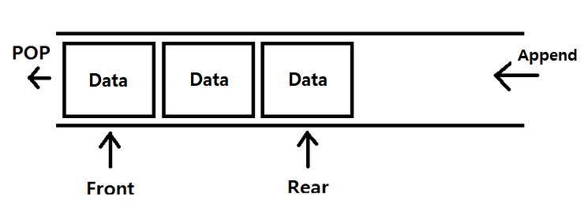
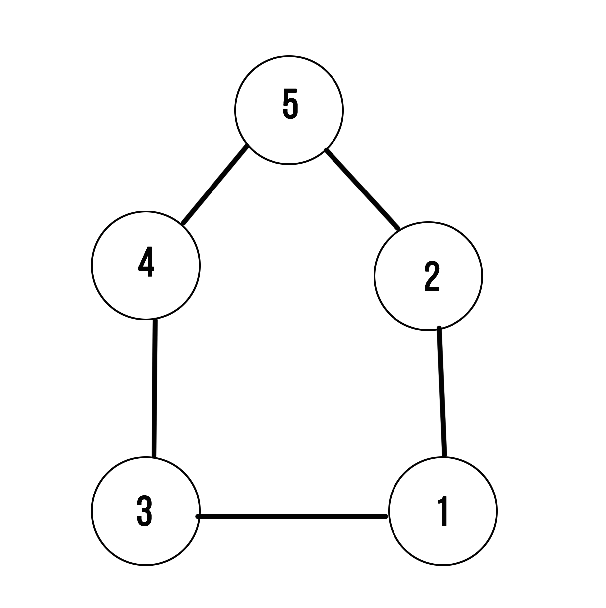

# BFS

작성일: 2021년 12월 10일 오후 6:27

Breadth First Search약자로 **너비 우선 탐색**이라고 불리며, 그래프에서 가까운 부분을 먼저 탐색하는 알고리즘입니다.

BFS 알고리즘은 주로 최단거리를 구할 때 사용합니다.

BFS 알고리즘을 이해하기 위해서는 큐 구조와 그래프의 구조에 대해 알아야 합니다.

### **큐(Queue)**

큐는 **선입선출(First In First Out)의 구조**입니다. 큐의 구조는 편의점에서 물품을 진열하는 방식과 같습니다.

편의점에서 새로 들어온 물건을 진열할 때는 기존의 물건들보다 뒤쪽에 진열합니다.

이전 물건들이 먼저 팔릴 수 있도록 하기 위함입니다.

큐도 이와 같습니다.

그림으로 보면 다음과 같습니다.



큐 구조

파이썬에서는 큐에 데이터를 삽입할 때 queue.append() 메서드를 사용하고 삭제할 때는 queue.popleft() 메서드를 사용합니다.

이제 BFS 알고리즘에 대해 자세히 알아보겠습니다. **BFS의 동작 방식**은 다음과 같습니다.

① 탐색을 시작할 노드를 큐에 삽입하고 방문 처리를 한다.

② 큐에서 노드를 꺼내 해당 노드의 인접 노드 중에서 방문하지 않은 노드를 모두 큐에 삽입하고 방문 처리를 한다.

③ 2번의 과정을 더 이상 수행할 수 없을 때까지 반복한다.



```python
import sys
sys.setrecursionlimit(99999)

def bfs(s):
    queue = deque()
    visited_2 = [0]*(N+1)
    queue.append(s)
    visited_2[s] = 1

    while queue:
        t = queue.popleft
        course_2.append(t)
        for w in range(1,N+1):
            if arr[t][w] == 1 and visited_2[w] == 0:
                queue.append(w)
                visited_2[w] = 1

    return course_2

N,M,V =  map(int,input().split())

arr = [[0]*(N+1) for _ in range((N+1))]
visited = [0]*(N+1)
course_2 = []
for i in range(M):
    start, end = map(int,input().split())
    arr[start][end] = 1
    arr[end][start] = 1

print(*dfs(V)
print(*bfs(V))
```